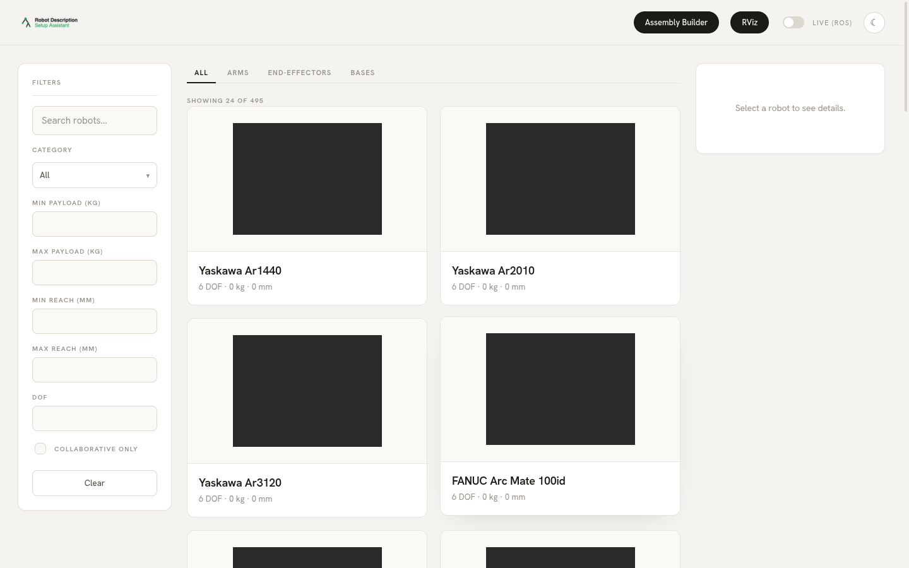
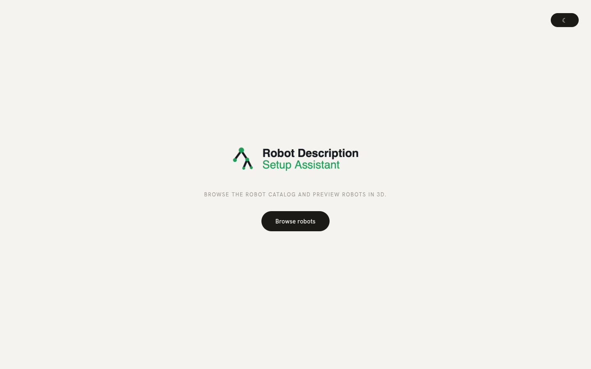
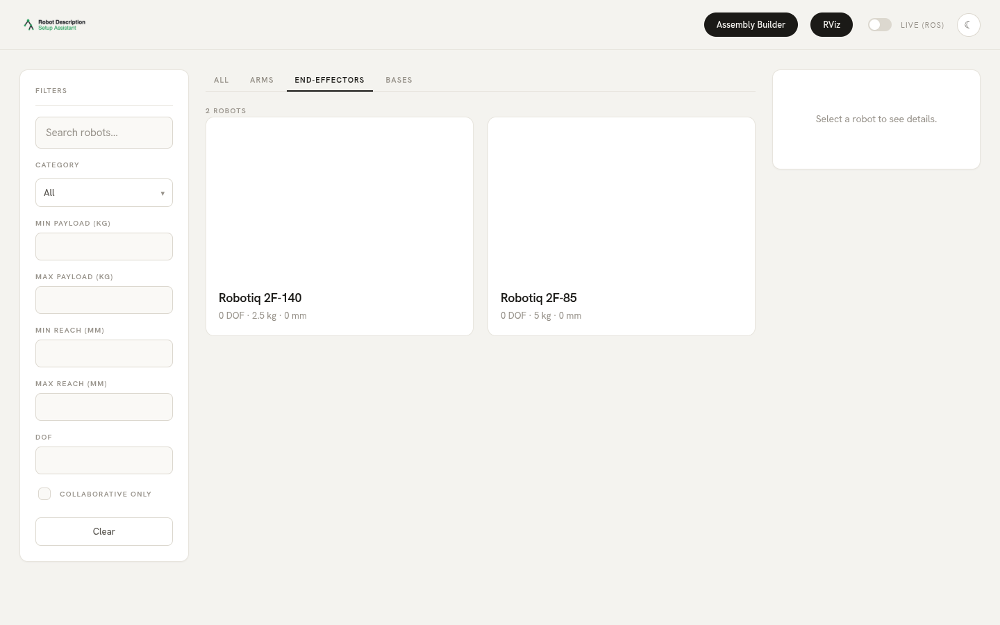
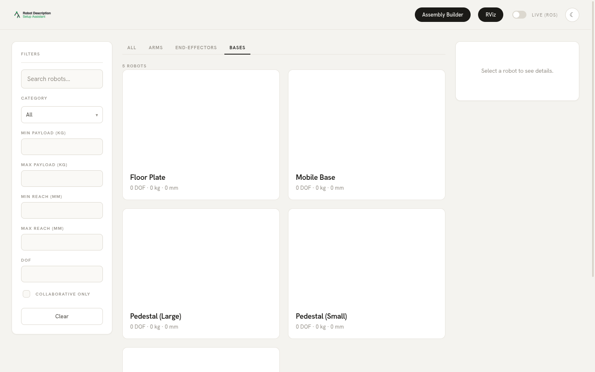
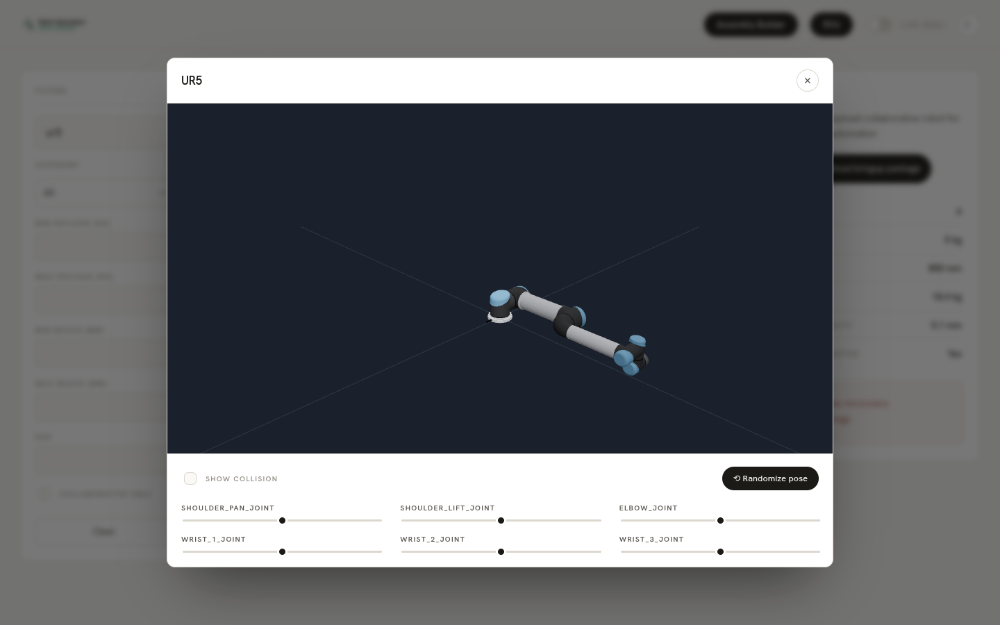
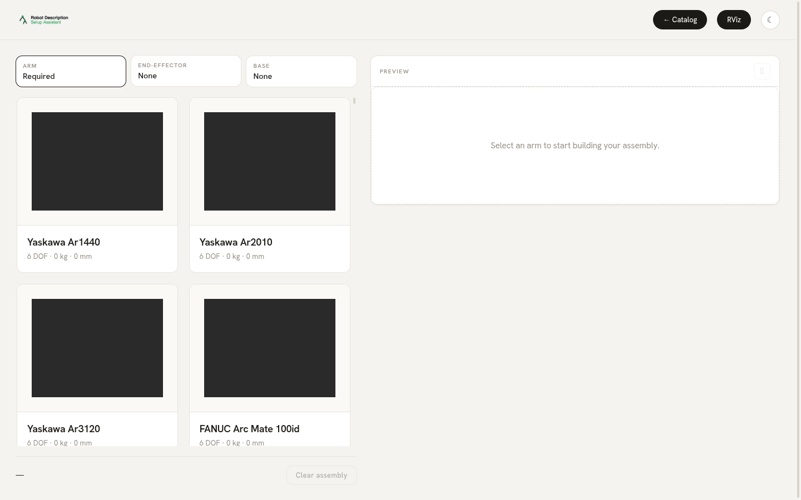
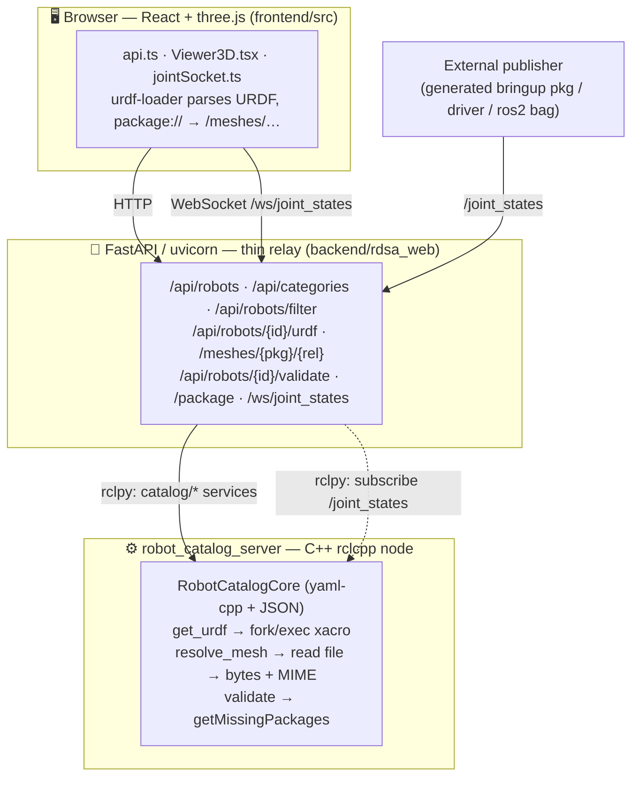

# Robot Description Setup Assistant (RDSA)

> Browse a **495-robot** catalog of industrial & collaborative arms, grippers, and
> mounts — preview any of them in **3D in the browser**, pose them live or by hand,
> compose **arm + end-effector + base** assemblies, and export a ready-to-launch
> ROS 2 **bringup package** — all from one web app.



A ROS 2 **Humble** workspace where all the heavy lifting (YAML parsing,
`xacro`→URDF expansion, `package://` mesh resolution, package validation) runs in
**C++** nodes; a thin **Python / FastAPI** server relays them over HTTP + WebSocket;
and a **React + three.js** single-page app renders everything in the browser.

> The original Qt / RViz / MoveIt desktop setup assistant has been **removed** in
> favour of this web UI. The workspace no longer depends on Qt5, RViz, or MoveIt.

---

## Table of contents

- [Highlights](#highlights)
- [Screenshots](#screenshots)
- [The catalog](#the-catalog)
- [Architecture](#architecture)
- [Repository layout](#repository-layout)
- [Dependencies (submodules)](#dependencies-submodules)
- [Quick start](#quick-start)
- [Development](#development)
- [How the main flows work](#how-the-main-flows-work)
- [Adding robots, grippers & bases](#adding-robots-grippers--bases)
- [Tooling & scripts](#tooling--scripts)
- [Further reading](#further-reading)
- [License](#license)

---

## Highlights

| | |
|---|---|
| 🤖 **495 components** | 488 arms (KUKA · FANUC · Yaskawa · ABB · Universal Robots), 2 Robotiq grippers, 5 bases |
| 🖥️ **Browser 3D** | three.js + `urdf-loader`; visual + lazy collision geometry, camera auto-fit |
| 🎚️ **Two posing modes** | client-side joint sliders / collision-aware randomize, **or** mirror a live ROS `/joint_states` graph over WebSocket |
| 🧩 **Assembly builder** | pick arm + end-effector + base; composition stays `N + M`, never enumerated |
| 📦 **Export** | download a generated `<id>_bringup` ament package (`robot_state_publisher` + `joint_state_publisher_gui`) |
| ⚙️ **C++ core** | catalog, xacro, mesh bytes, validation all in C++ over ROS services — Python touches **zero** filesystem |
| 🔌 **One command** | `./run.sh` boots the C++ node + API + SPA on `http://127.0.0.1:8000` |

---

## Screenshots

| Start screen | Catalog grid (All) |
|---|---|
|  |  |

| End-effectors tab | Bases tab |
|---|---|
|  |  |

| 3D viewer (UR5) + joint sliders | Assembly builder |
|---|---|
|  |  |

The catalog is split into four tabs — **All**, **Arms**, **End-effectors**,
**Bases** — backed by the C++ `catalog/filter_robots` service (filter by type,
category, payload/reach range, DOF, collaborative-only, tags, and free-text search).

---

## The catalog

495 entries are served from `robot_description_setup_assistant/config/catalog/`
(a directory of `*.yml` files merged by the loader).

### Arms — 488

| Brand | Count | Source package |
|---|--:|---|
| KUKA | 169 | `deps/kuka_robot_descriptions` |
| FANUC | 111 | `deps/fanuc_robot_descriptions` |
| Yaskawa Motoman | 100 | `deps/yaskawa_robot_descriptions` |
| ABB | 99 | `deps/abb_robot_descriptions` |
| Universal Robots | 9 | `deps/ur_robot_descriptions` |

> The four large vendor catalogs are **auto-generated** by
> [`scripts/generate_catalog.py`](scripts/generate_catalog.py) from the vendored
> description packages and use a placeholder card image. Universal Robots are
> hand-curated with full specifications (DOF, payload, reach).

### End-effectors — 2

| ID | Name | Notes |
|---|---|---|
| `robotiq_2f85` | Robotiq 2F-85 | adaptive 2-finger, 85 mm stroke |
| `robotiq_2f140` | Robotiq 2F-140 | adaptive 2-finger, 140 mm stroke |

### Bases — 5

| ID | Name |
|---|---|
| `floor_plate` | Floor Plate |
| `pedestal_small` | Pedestal (Small) |
| `pedestal_large` | Pedestal (Large) |
| `table_mount` | Workbench Mount |
| `mobile_base` | Mobile Base |

Categories (`config/catalog/categories.yml`): `abb`, `fanuc`, `kuka`, `yaskawa`,
`universal_robots`, `grippers`, `bases`, and `franka` (declared, currently empty).

---

## Architecture

**One front-end, one domain, three languages.** The robot-catalog domain
(`RobotConfig` / `RobotSpecifications` / `CategoryInfo` / `RobotFilter`) is mirrored
in C++ (source of truth), Python (Pydantic), and TypeScript (interfaces) with
identical filter semantics.



**Core principle:** in production (`RDSA_CATALOG_BACKEND=cpp`) **C++ does all
parsing/resolving; Python only relays.** C++ reads mesh files and returns raw bytes
(≤ 5 MiB cap, with a path-traversal guard); Python wraps the bytes in a response and
never touches the filesystem. A pure-Python fallback (`RDSA_CATALOG_BACKEND` unset)
is used by tests/CI and needs no ROS.

### Two processes

1. **`robot_catalog_server`** — C++ node, the catalog source of truth.
2. **uvicorn** (FastAPI) — HTTP/WS relay + serves the built SPA. It embeds two
   rclpy nodes of its own (`rdsa_catalog_client` for the services,
   `rdsa_joint_relay` for `/joint_states`).

### Catalog services (`robot_catalog_msgs/srv/`)

| Service | Request → Response |
|---|---|
| `catalog/get_robots` | `offset, limit` → `robots_json, total` |
| `catalog/get_categories` | — → `categories_json` |
| `catalog/filter_robots` | type/category/payload/reach/dof/tags/search/offset/limit → `robots_json, total` |
| `catalog/validate_robot` | `robot_id` → `found, ok, missing_packages[]` |
| `catalog/get_urdf` | `robot_id` → `found, ok, urdf_xml, missing_packages[], error` |
| `catalog/resolve_mesh` | `package, rel_path` → `ok, too_large, size_bytes, data[], media_type` |

> Full detail: [`ARCHITECTURE.md`](ARCHITECTURE.md) (workspace-wide map) and
> [`deps/app-robot-description-setup-assistant/ARCHITECTURE.md`](deps/app-robot-description-setup-assistant/ARCHITECTURE.md)
> (web-stack internals).

---

## Repository layout

```
robot-description-setup-assistant/
├── robot_catalog_core/         # C++ lib: YAML/dir load, filter, xacro, mesh read, JSON
├── robot_catalog_msgs/         # .srv definitions for the catalog services
├── robot_catalog_server/       # rclcpp node advertising catalog/* services
├── robot_description_setup_assistant/   # data-only: catalog config/, resources/, web launch
│   └── config/catalog/{arms,end_effectors,bases}/*.yml + categories.yml
├── deps/                       # git submodules (web app + vendor descriptions)
│   └── app-robot-description-setup-assistant/   # the web app (FastAPI + React) — separate repo
├── scripts/                    # catalog generation + image placeholder helpers
├── docs/images/                # README screenshots
├── run.sh                      # one-command launcher
├── ARCHITECTURE.md             # workspace-wide architecture
└── README.md
```

### Packages

| Package | Role | Key deps |
|---|---|---|
| `robot_catalog_core` | Catalog library: YAML/dir load, filter, URDF (xacro), mesh read, JSON writer | yaml-cpp, ament_index_cpp |
| `robot_catalog_msgs` | The 6 `.srv` service definitions | rosidl |
| `robot_catalog_server` | rclcpp node advertising `catalog/*` services | rclcpp + the two above |
| `robot_description_setup_assistant` | **Data-only**: catalog `config/`, robot `resources/`, `webui.launch.py` | ament_cmake |
| `deps/app-robot-description-setup-assistant` | FastAPI backend (rclpy bridge) + React/three.js frontend | fastapi, rclpy / vite, urdf-loader |

---

## Dependencies (submodules)

All vendored under `deps/` (see [`.gitmodules`](.gitmodules)).

| Submodule | Provides | Upstream |
|---|---|---|
| `app-robot-description-setup-assistant` | The web app (FastAPI + React SPA) | github.com/sshaizkhan/app-robot-description-setup-assistant |
| `abb_robot_descriptions` | ABB arms (IRB, CRB, YuMi) | github.com/sshaizkhan/abb_robot_description |
| `fanuc_robot_descriptions` | FANUC arms (M/R-series, CRX, LR Mate…) | github.com/sshaizkhan/fanuc_robot_descriptions |
| `kuka_robot_descriptions` | KUKA arms (KR series, iisy, Iontec…) | github.com/sshaizkhan/kuka_robot_descriptions |
| `yaskawa_robot_descriptions` | Yaskawa/Motoman arms (GP, MH, MA, SIA…) | github.com/sshaizkhan/yaskawa_robot_descriptions |
| `ur_robot_descriptions` | Universal Robots (UR3/3e … UR20, UR30) | github.com/UniversalRobots/Universal_Robots_ROS2_Description |
| `ros2_robotiq_gripper` | Robotiq 2F-85 / 2F-140 grippers | github.com/PickNikRobotics/ros2_robotiq_gripper |

---

## Quick start

### Prerequisites

- **ROS 2 Humble** (`/opt/ros/humble`)
- **Python 3.10** with `uv` *or* `python3-venv`
- **git**, **curl**, **tar**, **gzip** (clone, daegz filter, mesh-bundle download)
- **Node.js** ≥18 is *optional* — `run.sh` auto-bootstraps a local Node into
  `.cache/` (no sudo) if `npm` is missing, just to build the frontend once
- A colcon workspace — this repo lives at `<ws>/src/robot-description-setup-assistant`

### 1. Clone & bootstrap

```bash
git clone https://github.com/sshaizkhan/robot-description-setup-assistant.git
cd robot-description-setup-assistant
./bootstrap.sh           # registers the daegz mesh filter + inits submodules
```

> ⚠️ **Don't use `git clone --recurse-submodules`.** The description submodules
> store `*.dae` gzip-compressed behind a *required* `daegz` git filter, so a
> naive recursive clone fails (or leaves gzipped blobs). [`bootstrap.sh`](bootstrap.sh)
> registers the filter first, then inits the submodules so the meshes decompress.

### 2. Build the workspace (once)

> ⚠️ **Low-RAM machine:** build with `--parallel-workers 1` and `--symlink-install`
> (the latter avoids copying ~17 GiB of meshes into `install/`). Never run a
> full-parallel `colcon build`.

```bash
BUILD=1 ./bootstrap.sh   # filter + submodules + colcon build (parallel-workers 1)
```

…or build manually:

```bash
cd <ws>                  # colcon workspace root (repo is at <ws>/src/…)
source /opt/ros/humble/setup.bash
colcon build --merge-install --symlink-install --parallel-workers 1 \
  --packages-select robot_catalog_msgs robot_catalog_core robot_catalog_server \
    robot_description_setup_assistant abb_robot_descriptions fanuc_robot_descriptions \
    kuka_robot_descriptions ur_description yaskawa_robot_descriptions robotiq_description
source install/setup.bash
```

### 3. Run

```bash
cd src/robot-description-setup-assistant
./run.sh                 # → http://127.0.0.1:8000
./run.sh 0.0.0.0 8000    # expose on the LAN
```

`run.sh` sources ROS + the workspace, bootstraps the backend venv (prefers `uv`,
falls back to stdlib `venv`), builds the frontend if `dist/` is missing
(`BUILD_FRONTEND=1` forces a rebuild), **downloads the prebuilt GLB mesh bundle**
(see below; `SKIP_MESH_BUNDLE=1` to opt out), starts the C++ catalog node, waits
for its services, then serves the API + SPA from one uvicorn process.

### Optimized meshes (web viewer)

Vendor visual meshes are large COLLADA (`.dae`) — FANUC/KUKA links reach 30–116 MiB,
over the 5 MiB mesh cap and slow to load. CI converts them **once** to compact
Draco-compressed glTF (`.glb`) and publishes a `meshes-<hash>.tar.gz` bundle as a
GitHub Release (keyed to the description submodule commits). On launch,
[`scripts/mesh-bundle.sh`](scripts/mesh-bundle.sh) (called by `run.sh`) downloads
the matching bundle — no local conversion. The backend serves it at `/meshes-opt`
and the viewer prefers the GLB, falling back to the source `.dae`.

- Re-downloads only when a description submodule changes (the hash key).
- Offline / custom robots: it falls back to generating the bundle locally.
- ROS2-only users who don't need the web viewer: `SKIP_MESH_BUNDLE=1 ./run.sh`.

---

## Development

Hot-reload dev workflow (frontend Vite server proxies `/api`, `/meshes`, `/ws` to
the backend) and test commands live in the web app's
[`QUICKSTART.md`](deps/app-robot-description-setup-assistant/QUICKSTART.md).

```bash
# backend tests
cd deps/app-robot-description-setup-assistant/backend && pytest
# frontend tests
cd deps/app-robot-description-setup-assistant/frontend && npm test
```

---

## How the main flows work

- **Grid load** → `/api/robots` → `catalog/get_robots` (C++) → JSON → cards.
- **Open viewer** → `/api/robots/{id}/urdf` → `catalog/get_urdf` runs `xacro` in
  C++ → XML to browser → `urdf-loader` parses it → mesh `GET`s hit `/meshes/…` →
  `catalog/resolve_mesh` (C++) returns bytes (≤ 5 MiB, else **HTTP 413**).
- **Manual pose** → sliders call `setJointValue()` on the three.js model;
  *Randomize* rejection-samples a collision-free pose, all client-side.
- **Live pose** → an external publisher posts `/joint_states` → `JointStateRelay`
  caches it → `/ws/joint_states` streams at ~10 Hz → the viewer mirrors it.
- **Export** → `/api/robots/{id}/package` → a zipped `<id>_bringup` ament package
  whose `view.launch.py` starts `robot_state_publisher` +
  `joint_state_publisher_gui` (which then *becomes* the live `/joint_states` source).

See [`ARCHITECTURE.md` §7](ARCHITECTURE.md) for the end-to-end sequences.

---

## Adding robots, grippers & bases

Catalog entries are plain YAML merged from `config/catalog/`. To add an
**end-effector**, drop a `*.yml` with `type: end_effector` into
`config/catalog/end_effectors/` — the schema and the arm⇄EE attachment contract
(`tool_frame` ↔ `mount_frame` + `xyz`/`rpy` offset) are documented in
[`config/catalog/end_effectors/README.md`](robot_description_setup_assistant/config/catalog/end_effectors/README.md).

Bulk arm catalogs are regenerated from the vendor submodules:

```bash
python3 scripts/generate_catalog.py     # rewrites config/catalog/arms/<vendor>.yml
```

---

## Tooling & scripts

| Script | Purpose |
|---|---|
| [`bootstrap.sh`](bootstrap.sh) | Fresh-clone setup: register the `daegz` mesh filter, init submodules (decompressing `.dae`), and optionally `colcon build` (`BUILD=1`, low-RAM friendly). |
| [`scripts/mesh-bundle.sh`](scripts/mesh-bundle.sh) | Manage the optimized GLB mesh bundle: `hash` (bundle id), `fetch` (download the matching Release asset, else build locally), `build`, `pack`. Called by `run.sh`. |
| [`scripts/generate_catalog.py`](scripts/generate_catalog.py) | Enumerate each vendor's `urdf/*.urdf.xacro` (with a matching `config/<type>/`), read DOF from `joint_limits.yaml`, and emit `config/catalog/arms/<vendor>.yml`. Idempotent. |
| [`scripts/make_placeholder.py`](scripts/make_placeholder.py) | Generate a 400×300 dark-gray PNG card placeholder using only the Python stdlib (no Pillow). |
| [`scripts/test_generate_catalog.py`](scripts/test_generate_catalog.py) | Tests for the catalog generator. |

---

## Further reading

- [`ARCHITECTURE.md`](ARCHITECTURE.md) — workspace-wide architecture & end-to-end flows.
- [`deps/app-robot-description-setup-assistant/ARCHITECTURE.md`](deps/app-robot-description-setup-assistant/ARCHITECTURE.md) — web-stack internals.
- [`deps/app-robot-description-setup-assistant/QUICKSTART.md`](deps/app-robot-description-setup-assistant/QUICKSTART.md) — dev workflow & tests.
- [`config/catalog/end_effectors/README.md`](robot_description_setup_assistant/config/catalog/end_effectors/README.md) — catalog entry schema & attachment contract.

---

## License

See [`LICENSE`](LICENSE).
